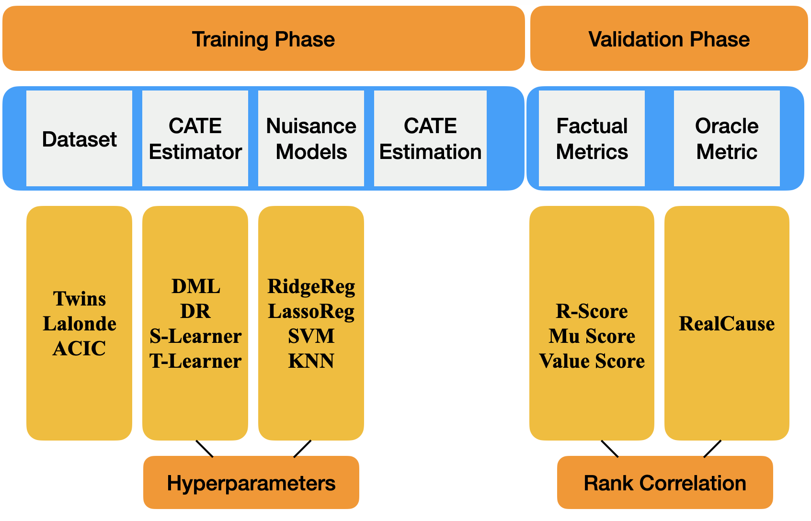

# Empirical Analysis of Model Selection for Heterogeneous Causal Effect Estimation
Code accompanying the paper [Empirical Analysis of Model Selection for Heterogeneous Causal Effect Estimation](https://arxiv.org/abs/2211.01939)

# Brief note about the paper



We study the problem of model selection in causal inference, specifically for the case of conditional average treatment effect (CATE) estimation under binary treatments. Unlike model selection in machine learning, we cannot use the technique of cross-validation here as we do not observe the counterfactual potential outcome for any data point. Hence, we need to design model selection techniques that do not explicitly rely on counterfactual data. As an alternative to cross-validation, there have been a variety of proxy metrics proposed in the literature, that depend on auxiliary nuisance models also estimated from the data (propensity score model, outcome regression model). However, the effectiveness of these metrics has only been studied on synthetic datasets as we can observe the counterfactual data for them. We conduct an extensive empirical analysis to judge the performance of these metrics, where we utilize the latest advances in generative modeling to incorporate multiple realistic datasets. We evaluate 9 metrics on 144 datasets for selecting between 415 estimators per dataset, including datasets that closely mimic real-world datasets. Further, we use the latest techniques from AutoML to ensure consistent hyperparameter selection for nuisance models for a fair comparison across metrics.

# Reproducibility


## Setup

Please download the ACIC 2016 and ACIC 2018 datasets and place them in `$HOME/scratch/` directory.

Use the requirements.txt file for installing the dependencies.

## Reproduce Results

```python scripts/reproduce_results.py```

## Analyzing results using logged DataFrame

For ease, we have provided the final dataframe that contains the data after training all the CATE estimators across all the datasets. The corresponding file (logs_ensemble.csv) can be found in the results directory.

- To generate the main table, execute the following command:
 ``` python scripts/cate_analysis.py --generate_df 0 --analysis_case ensemble_htune_pehe  ```

## Training CATE estimators

To train CATE estimators and reproduce the logged DataFrame, we describe the commands ahead for the dataset ``twins`` and seed `0`. The same commands can be executed for the reamining seed values and the complete list of datasets can be constructed as follows:

- Real Cause Datasets: `['twins', 'lalonde_psid1', 'lalonde_cps1']`
- ACIC 2016 Datasets: Load the file `datasets/acic_2016_heterogenous_list.p`
- ACIC 2018 Datasets: Load the file `datasets/acic_2018_heterogenous_list.p`

Before training the CATE estimator, we first need to ensure that we have selected the corresponding nuisance models via AutoML. To do the nuisance model selection for a given dataset and seed value, execute the following command:

`python nuisance_model_selection.py  --seed 0 --dataset twins `

After the nuisance model selection, we can execute the following command to train a particular CATE estimator for this dataset and seed. 

`python train.py  --seed 0 --dataset twins --estimator dml_learner `

The complete list of CATE estimators to be trained is as follows: `['dml_learner', 'dr_learner', 'x_learner', 'causal_forest_learner', 's_learner', 't_learner', 's_learner_upd' ]`

After training all the CATE estimators for this datasets and seed, we will train the Ensemble CATE estimators.

`python ensemble_train.py  --seed 0 --dataset twins `

